# sql_challenge

### contains:
1. erd.png: an image of an entity relationship diagram for the tables in the sql database sql-challenge
2. schemata.sql: a file showing the schemas for the tables in the sql-challenge database
3. queries.sql: a file showing the queries to the sql-challenge database
4. salary_analysis.ipynb: a jupyter notebook showing graphs generated from queries to the sql-challenge database
5. images: contains the screengrabs of queries as shown in this README

### description: 
This repository is sourced in information on company employees hired in the 1980s and 1990s, found in csv files. The goal of this project was to import the csvs into a SQL database and return results of queries from tables in the database. Additionally, visualisations of the relationships between the salary and title tables were created in a jupyter notebook. 

To accomplish those goals, the following steps were taken:

* CSV Inspection and Entity Relationship Diagram creation (file 1)
    - 6 csvs, each with one table, were provided. The tables within the csvs were: departments, dept_emp (department employees), dept_manager (department managers), employees, salaries, and titles
    - upon visual inspection of the source csvs, the columns in the csvs were assigned data types
    - the unique columns in each csv's table were designated primary keys
    - columns in each csv's table that reference columns in other csvs were designated foreign keys 
* Creation of SQL Database and Schemata; CSV Importation (file 2) 
    - a database was created in pgAdmin, called sql-challenge
    - drawing on the ERD, schemas were written and saved to the file schemata.sql, using postgreSQL syntax, to create tables with the same relationships, foreign, and primary keys in the SQL database
    - the csvs were imported into the appropriate tables in the sql-challenge database
* Data Analysis: Queries to the SQL Database (file 3)
    - queries were put to the database to retrieve the following information, and were saved to the file queries.sql (screenshots of the first 16 rows of each query's results are shown below):
        1. For each employee, list: employee number, last name, first name, sex, and salary.
            

            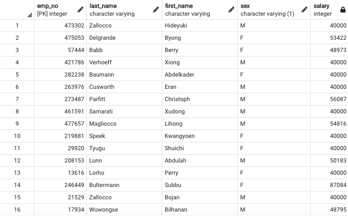
            

        2. List first name, last name, and hire date for employees hired in 1986.
            

            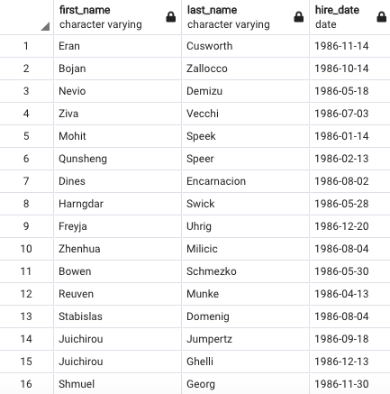
            

        3. For each department manager, list: department number, department name, the manager's employee number, last name, first name.
            

            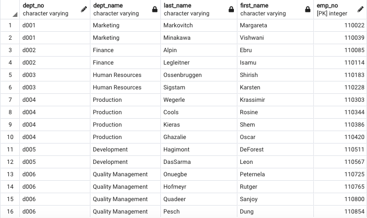
            

        4. List the department of each employee with: employee number, last name, first name, and department name.
            

            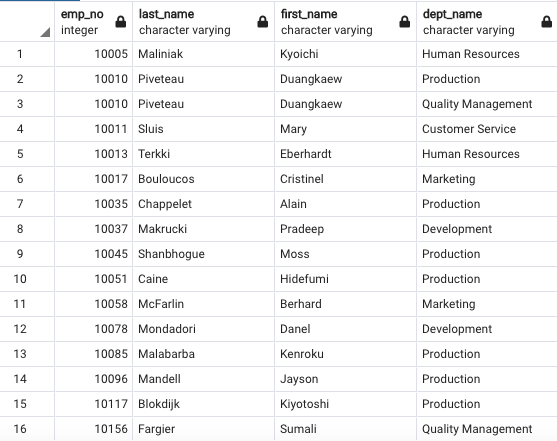
            

        5. List first name, last name, and sex for employees with first name 'Hercules' and last name beginning with 'B'.
            

            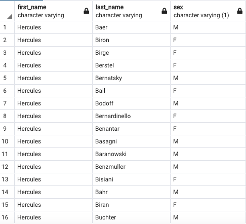
            

        6. List all employees in the Sales department, with their employee number, last name, first name, and department name.
            

            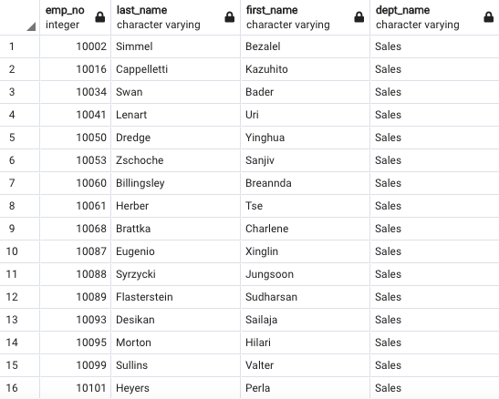
            

        7. List all employees in the Sales and Development departments, with their employee number, last name, first name, and department name.
            

            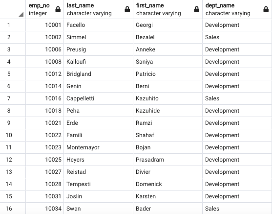
            

        8. In descending order, list the frequency count of employee last names.
            

            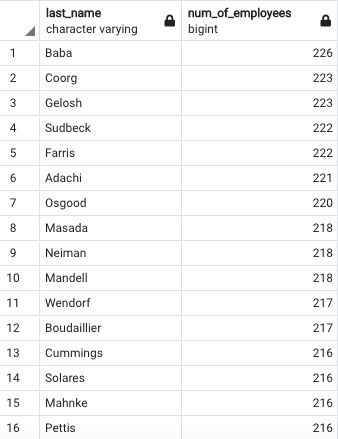
            

* Data Visualisation: Importing SQL database into Jupyter Notebook, Graphs (file 4)
    - using SQLAlchemy, the sql-challenge SQL database was imported into the jupyter notebook salary_analysis.ipynb
    - the salaries table from the database was called into the notebook, and made into the dataframe salaries_df
    - after checking for null values in salaries_df, a histogram was made of the salary column, showing the distribution of salary ranges across the employees
        

            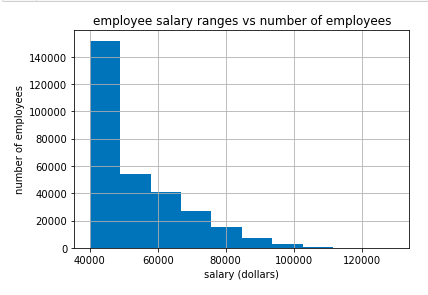
        

    - a query to get the average salary by job title was called into the notebook and made into the dataframe sal_title_df
    - after checking for null values in sal_title_df, a bar graph was created to compare the average salaries by job title across job titles
        

            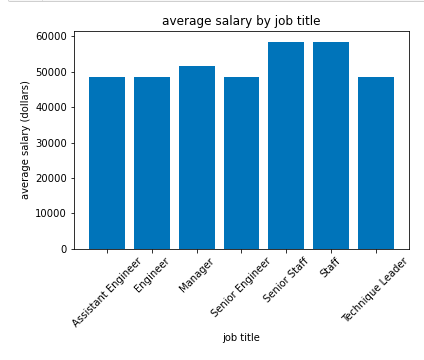
        

    - upon observing the bar graph from sal_title_df, another query requesting the titles of jobs making over $50,000, creating the dataframe high_titles_salaries_df, and the function .value_counts() was called on it, to observe the number of employees within each job title making over 50000
    - also as a result of the bar graph from sal_title_df, another query requesting all job titles for all employees, and their salaries, creating the dataframe all_titles_salaries_df. The function .describe() was called on the dataframe, in order to get some simple statistics
        

            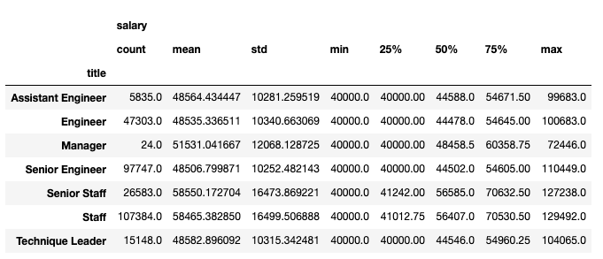
        

    - finally, salaries for the job titles 'Engineer' and 'Senior Staff' (the job titles with the lowest and highest mean salary respectively) were created into lists (engineer_salaries, senior_staff_salaries), and an independent t-test was ran upon them
    
### observations:
The ER diagram revealed a two main concepts within the data set: employees and departments. The employees table relates personal attributes of each employee, and the salaries and titles branch off from the employees table to describe qualities relating to the employees as parts of the organisation: their salaries and their job titles. The departments table gives the names and IDs of the departments. The departments and employees tables are connected by two intermediate tables where the employees are filtered into managers and employees of departments.

Several of the relationships in the tables are one-to-one: one employee has one salary and one title. The relations are one-to-many for the department employee, department manager and departments tables: one employee can belong to multiple departments, one department can have many employees, and one department can have several managers.

When converting the ERD into SQL schemata, these relationships between tables played a role in the order of table creation: first, creating the tables the employees table depended on (titles, salaries), then the employees table, then the departments table, which is independent, then the tables that depend on both the departments and employees tables (dept_managers, dept_emp). 

The department employee table required a composite key, due to the one-to-many relationship between the employees and department employees tables (one employee can be in multiple departments), meaning that employee IDs can repeat in the column, and thus cannot be a unique identifier (the way it is in the employees table) on its own. It might have been useful for the dept_emp table to have a third column, 'employee-department_id', which would have been a unique id that could be used as a primary key instead, bringing the table up to the third normal form. 

The constraints of primary key labels is useful for checking whether the relationships between tables have been ascertained accurately: the dept_emp csv could not be properly imported into the sql-challenge database until the composite key was used instead of using the employee ID as a primary key. 

From a data analytics perspective, the division of the data into the existing tables makes queries such as returning the names, ids, and department names for all employees in Sales more complex, as it requires pulling from three tables. It might seem easier to create only two tables, one for departments and one for employees, with all the information pertaining to those entities in each table, connected by employee IDs. 

However, from a data modelling perspective, there are actually three types of bodies in this data set that must be represented: employees as individual entities, employees as parts of departments, and departments as corporate entities. Furthermore, in order to not have any distributive dependencies, those three bodies must have tables that only rely on the primary key of each table (emp_no, title_no, or dept_no).

The data visualisations reveal that the data set is a bit suspicious. The histogram graph shows the majority of the employees making between $40,000 - $50,000. One would expect that the distinction between the majority of employees making one salary and other fewer employees having higher salaries would be due to their job titles, with more senior jobs making more money; when looking at the bar chart breaking down average salary by job title, the job titles staff, senior staff, and (to a lesser degree) manager  show higher average salaries. The difference between the job with the highest average salary (senior staff) and lowest average salary (engineer) is statistically significant. The job title 'staff' is somewhat vague, but the other titles 'senior staff' and 'manager' do appear to be higher level jobs. 

But when looking at the variation within each job title, each job title, even the 'senior' ones of manager or senior staff, has a minimum value of $40,000. The difference in average salaries arises from the maximum values in managers, staff, and senior staff being higher. This suggests that there are either ranks within each job title that are not noted, or that the seniority of a job title does not have bearing on employee salaries. The latter theory is boosted by the fact that the job title 'senior engineer' has an average salary lower than that of 'engineer' or 'assistant engineer'.

The distribution of employees also seem odd. Whatever the vague job title 'staff' means, they are the largest group of employees, and the second most highly paid. Their being the largest group of employees suggests that they are not an upper level type of employee, which is incongruous with their having larger salaries. One might imagine that the salary and job titles in this data set were assigned randomly - and indeed this data set is artificial. 